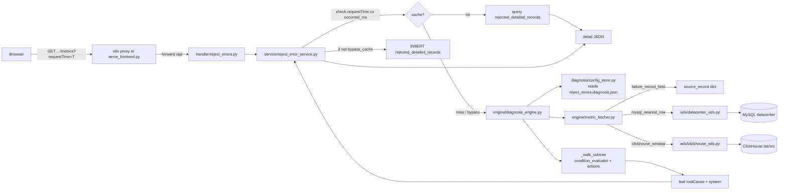
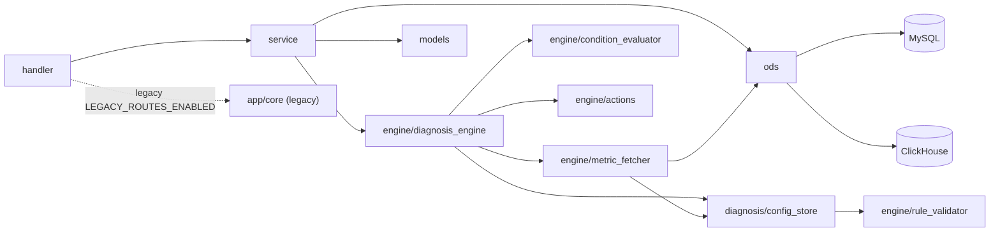

# UIX-Graph 项目目录约定

> 本文件回答两个问题:**「这个项目的目录长什么样?」**、**「我要做 X 件事,该改哪儿?」**
> 任何时候发现某个目录不在本文档里,请补进来,而不是把它当成「未知」绕过去。
>
> 维护人:任何 PR 修改的目录如果在本文档里没记录,审核时要求一并更新。

---

## 1. 顶层目录(30 秒导航)

| 目录 / 文件 | 用途 | 归属 | 是否在迭代 |
|-------------|------|------|-----------|
| `src/backend/` | FastAPI 后端,所有业务逻辑 | **主线 stage3/stage4** | ✅ 是 |
| `src/frontend/` | React + Vite 前端,**约定唯一前端** | **主线 stage3/stage4** | ✅ 是 |
| `config/` | 运行时配置(诊断规则、连接信息) | 主线 | ✅ 是 |
| `scripts/` | 启动器、打包、初始化 SQL、辅助脚本 | 主线 + 工具 | ✅ 是 |
| `docs/` | 设计文档、交接文档、内网 schema | 主线 + 历史 | 部分 |
| `deploy/` | 内网部署辅助(nginx 配置等) | 部署 | 偶尔改 |
| `docker/` | 容器化(`docker-compose.yml` 配套) | 部署 | 偶尔改 |
| `Dockerfile`、`docker-compose.yml` | 本地 docker 一键起 MySQL+ClickHouse | 部署 | 偶尔改 |
| `start_UIX.bat`、`start_UIX.command` | 跨平台一键启动入口(包装 `scripts/start.py`) | 部署 | 偶尔改 |
| `archive/` | **冻结的历史代码**(只读快照,不在任何运行路径上) | 历史 | 不改 |
| `README.md` | 仓库门面 + 快速启动 | 必读 | ✅ 是 |
| `.cursor/`、`.vscode/` | IDE 配置(rules/mcp.json 等团队共享) | 工具 | 偶尔改 |
| `.gitignore`、`.uvrc`、`.dockerignore` | 仓库级配置 | 工具 | 偶尔改 |

---

## 2. 后端 `src/backend/`

```
src/backend/
├── app/
│   ├── main.py                      # FastAPI 入口 + 路由注册 + 全局异常处理
│   ├── handler/                     # API 层(Controller),只做 HTTP 解析+响应封装
│   │   ├── reject_errors.py         # ★ Stage3 主接口(拒片故障管理 1/2/3),始终注册
│   │   ├── ontology.py              # 老路由(本体)── feature-flagged,LEGACY_ROUTES_ENABLED 默认 true
│   │   ├── knowledge.py             # 老路由(知识)── 同上
│   │   ├── diagnosis.py             # 老路由(通用诊断)── 同上;实现仍在 app/core/
│   │   ├── visualization.py         # 老路由(可视化)── 同上
│   │   ├── propagation.py           # 老路由(传播)── 同上
│   │   ├── full_graph.py            # 老路由(全图)── 同上
│   │   └── entity.py                # 老路由(实体)── 同上
│   │
│   ├── service/                     # 业务逻辑层(本应是主要业务沉淀地)
│   │   └── reject_error_service.py  # ★ Stage3 业务主线
│   │
│   ├── engine/                      # ★ 当前主诊断引擎(配置驱动 stage3/stage4)
│   │   ├── diagnosis_engine.py      # 决策树遍历器
│   │   ├── metric_fetcher.py        # 指标取数(MySQL/ClickHouse/intermediate/failure_record_field)
│   │   ├── condition_evaluator.py   # 条件表达式 DSL
│   │   ├── rule_loader.py           # 规则加载
│   │   ├── rule_validator.py        # 规则静态校验
│   │   └── actions/                 # 内置 action 函数(@register 装饰器)
│   │       ├── __init__.py          # 注册器 + 自动加载
│   │       └── builtin.py           # COWA 建模、Tx/Ty/Rw 均值计算等
│   │
│   ├── diagnosis/                   # 诊断配置层(单例 store)
│   │   ├── config_store.py          # 加载 config/diagnosis.json + 各 pipeline 文件
│   │   └── service.py               # 引擎工厂
│   │
│   ├── core/                        # ⚠️ 老引擎(图谱/本体/传播)— 跟 engine/ 平行存在
│   │   ├── diagnosis_engine.py      #   被 handler/diagnosis.py 用
│   │   ├── diagnosis_engine_prd1.py #   PRD1 老版本(可能可删)
│   │   ├── graph_builder.py
│   │   ├── full_graph_builder.py
│   │   ├── path_finder.py
│   │   ├── operators.py
│   │   └── test_data.py
│   │
│   ├── ods/                         # 数据访问层(MySQL / ClickHouse 直连)
│   │   ├── datacenter_ods.py        # MySQL datacenter
│   │   └── clickhouse_ods.py        # ClickHouse las/src
│   │
│   ├── models/                      # SQLAlchemy ORM
│   │   ├── reject_errors_db.py      # ★ 拒片相关 ORM
│   │   └── database.py              # 引擎/会话(老路由用)
│   │
│   ├── schemas/                     # Pydantic Schema(API 请求/响应)
│   │   ├── reject_errors.py         # ★
│   │   ├── diagnosis.py             # 老路由
│   │   └── ontology.py              # 老路由
│   │
│   └── utils/
│       ├── time_utils.py            # 时间戳互转
│       └── detail_trace.py          # 接口 3 排障日志(`[详情排障]` 前缀)
│
├── tests/                           # 13 个测试文件,见 §2.1
├── requirements.txt
└── README.md
```

### 2.1 后端测试现状

| 测试文件 | 是否依赖 DB | 跟主线关系 |
|---------|-------------|-----------|
| `test_metric_fetcher_window.py` | ❌ | 主线 |
| `test_rules_validator.py` | ❌ | 主线 |
| `test_rules_engine_conditions.py` | ❌ | 主线 |
| `test_rules_actions_implementation.py` | ❌ | 主线 |
| `test_rules_actions_binding.py` | ❌ | 主线 |
| `test_diagnosis_config_store.py` | ❌ | 主线 |
| `test_reject_error_detail.py` | 部分 | 主线 |
| `test_reject_errors.py` | ✅ MySQL | 主线集成 |
| `test_reject_errors_api.py` | ✅ MySQL | 主线集成 |
| `test_docker_seed_alignment.py` | ✅ MySQL+CH | 主线集成 |
| `test_docker_e2e_extend.py` | ✅ MySQL+CH | 主线集成 |
| `test_diagnosis_prd1.py` | ❌ | **老 PRD1 引擎**,跟 `app/core/diagnosis_engine_prd1.py` 一起待评估 |
| `test_core_diagnosis_adapter.py` | ❌ | **老 core 引擎适配测试**,同上待评估 |

**CI 推荐跑**:不带 ✅ 的 9 个文件。带 ✅ 的需要本地起 docker-compose 后才能跑(`docs/deployment/docker_local_e2e.md`)。

---

## 3. 前端 `src/frontend/`

```
src/frontend/
├── src/
│   ├── pages/
│   │   ├── FaultRecords.jsx       # ★ 唯一业务页面(故障记录管理)
│   │   └── FaultRecords.css
│   ├── components/                # 9 个通用组件(其中 ErrorBoundary/CustomSelect 实际在用)
│   ├── hooks/                     # useApi / useCache(部分组件已不再使用)
│   ├── services/api.js            # ★ 统一 API 层
│   ├── config/index.js            # 环境变量配置
│   ├── App.jsx
│   ├── main.jsx
│   └── index.css
├── vite.config.js                 # /api → :8000 代理
└── package.json
```

> **历史 UI 已归档**:原仓库根目录的 `frontend/`(老的多页面 UI,含知识录入/本体/全图谱等 6 个页面)已 `git mv` 到 [`archive/frontend-legacy/`](../archive/frontend-legacy/),不再在主线维护。详见 [`archive/README.md`](../archive/README.md);如需复活某老页面,按其中流程操作。

---

## 4. 配置 `config/`

```
config/
├── diagnosis.json                       # pipeline 索引(version=3.0.0)
├── reject_errors.diagnosis.json         # ★ Stage3 主诊断规则(28KB)
├── ontology_api.diagnosis.json          # 老 pipeline(配 handler/ontology)
├── connections.json                     # MySQL/ClickHouse 连接(local/test/prod 三档)
├── metrics_meta.yaml                    # 指标元数据(config_store 启动时合并进 metrics)
└── CONFIG_GUIDE.md                      # ★ 诊断规则编写权威说明
```

**改诊断规则的标准流程**:`metrics_meta.yaml` → `reject_errors.diagnosis.json` → `pytest tests/test_rules_validator.py tests/test_diagnosis_config_store.py`

---

## 5. 文档 `docs/`

```
docs/
├── STRUCTURE.md                         # ★ 本文件
├── HANDOVER.md                          # 交接说明 + 已知边界排坑
├── data_source.md                       # API 字段 → DB 字段映射
├── plans/
│   └── 2026-04-13-cowa-metric-source-fixes.md   # ★ 迭代中的实施计划
├── stage3/                              # Stage3(已基本完成,部分待办)
│   ├── prd3.md
│   ├── database_schema.md
│   ├── rules_execution_spec.md          # 诊断 DSL 执行契约 v1.2
│   ├── frontend_backend_integration.md
│   └── feature_todo.md
├── stage4/                              # ★ 当前迭代(指标源头梳理 + 台账方法论)
│   ├── prd.md
│   ├── reject_errors_config_mapping.md  # diagnosis.json 字段说明
│   └── diagnosis-path-template.md       # 专家访谈台账模板
├── intranet/                            # 内网/外网协作
│   ├── databases/                       # ★★ 内网数据库 schema 权威(供外网 mock)
│   │   ├── README.md
│   │   ├── mysql_datacenter.md
│   │   ├── clickhouse_las.md
│   │   └── clickhouse_src.md
│   ├── schema_reference.md              # 老版「内网字段标准」,已被 databases/ 取代
│   └── linking_tbd.md                   # 待业务确认的关联键清单
└── deployment/
    ├── docker_local_e2e.md              # 本地 docker 起 MySQL/CH 端到端
    ├── windows_intranet.md              # Windows 内网部署
    └── external.md                      # 外网部署
```

---

## 6. 脚本 `scripts/`

```
scripts/
├── start.py                  # ★ Tkinter GUI 一键启动器(主入口)
├── switch_env.py             # 切换 APP_ENV(local/test/prod)
├── serve_frontend.py         # 静态前端服务(start.py 调它)
├── package_intranet.ps1      # ★ 内网迁移打包(产出根目录 zip,zip 自动 .gitignore)
├── verify_docker_e2e.ps1     # docker e2e 烟测
│
├── init_docker_db.sql        # ★ MySQL docker 初始化(建表 + COARSE mock 数据)
├── init_clickhouse_local.sql # ★ ClickHouse docker 初始化
├── create_indexes.sql        # 索引补全(可选)
│
├── start_backend.ps1         # 仅后端启动(不走 start.py)
├── start_frontend.ps1
├── start_backend.sh          # *nix 版
├── start_frontend.sh
│
├── debug_engine.py           # 单步调试诊断引擎(命令行)
├── debug_rules.py            # 校验规则文件(命令行)
│
├── flow2data.py              # 老:流程 JSON → 图谱数据
├── merge_data.py             # 老:多 case 数据合并
├── process_data.py           # 老:数据预处理
├── api_response.json         # 老:接口响应快照
└── README.md
```

> 当前**用户操作主入口**:`scripts/start.py`(GUI)。其他 .sh / .ps1 是历史保留,后续清理时建议合并到 `scripts/dev/` 子目录。

---

## 7. 「我想做 X 件事,该改哪儿」对照表

| 想做的事 | 改哪些文件 | 备注 |
|---------|-----------|------|
| 改诊断规则(加个分支/调阈值) | `config/reject_errors.diagnosis.json` | 改完跑 `python scripts/check_config.py`(本地自助检查)+ `pytest tests/test_rules_validator.py tests/test_rule_validator_metric.py`;PR 按 [`CONFIG_REVIEW_CHECKLIST.md`](./CONFIG_REVIEW_CHECKLIST.md) 自查 |
| 加一个新的诊断指标(已有表的列) | `config/reject_errors.diagnosis.json` 加 `metrics.<id>` | 如指标依赖前序值,要在 metric_id 列表上保持顺序 |
| 加一个新的 DB 表作指标源 | 1. `docs/intranet/databases/<db>.md` 加表小节<br>2. `scripts/init_docker_db.sql` 或 `init_clickhouse_local.sql` 建表+mock<br>3. `config/reject_errors.diagnosis.json` 加 metric | **顺序重要**:文档先于代码 |
| 加一个新的 action 函数 | `src/backend/app/engine/actions/<新文件>.py`(用 `@register("name")` 装饰) | 自动加载,不用改 `__init__.py` |
| 加一个新接口 | `src/backend/app/handler/<新文件>.py` + `service/` + `schemas/` + `main.py` 注册 | 参考 `handler/reject_errors.py` |
| 改前端筛选 / 表格 | `src/frontend/src/pages/FaultRecords.jsx` | 主页面单文件 |
| 加一个前端页面 | `src/frontend/src/pages/<新文件>.jsx` + `App.jsx` 加路由 | 注意根目录 `frontend/` 不是这里 |
| 改后端启动逻辑 | `scripts/start.py`(主)/ `src/backend/app/main.py`(应用层) | start.py 是 GUI 启动器,不要把业务逻辑塞这里 |
| 改打包流程 | `scripts/package_intranet.ps1` | 产物 zip 自动忽略,不要 commit |
| 改本地 docker 数据 | `scripts/init_docker_db.sql` / `init_clickhouse_local.sql` | 按 §9 锚点对齐 |

---

## 8. 命名 / 编码 / 路径约定

| 项 | 约定 |
|---|------|
| 文件名 | **全部 ASCII**;中文名一律不入仓(已有 .gitignore 拦截) |
| Python 模块 | `snake_case` |
| React 组件 | `PascalCase.jsx` |
| metric_id | `snake_case`(`Mwx_0`、`mark_pos_x`、`trigger_log_mwx_cgg6_range`) |
| diagnosis step id | 整数或数字字符串(全局唯一) |
| 时间戳 | API 层一律 13 位毫秒(int);DB 层 DATETIME(6) |
| 字符集 | UTF-8(后端 main.py 已在启动时 `reconfigure(encoding="utf-8")`) |

---

## 9. Mock 锚点(贯穿所有文件)

为了让外网开发任何时候都能跑通**端到端 COWA 诊断样例**,所有 mock 与测试都围绕这一锚点对齐:

| 字段 | 锚点值 |
|------|--------|
| `equipment` | `SSB8000` |
| `chuck_id` | `1` |
| `lot_id` | `101` |
| `wafer_index` / `wafer_id` | `7` |
| `wafer_product_start_time` (T) | `2026-01-10 08:45:00` |
| `reject_reason` | `6` (COARSE_ALIGN_FAILED) |
| `recipe_id` | `RCP-DOCKER-001` |
| ClickHouse `file_time` | `[T - 7 天, T]`,推荐 `08:44:30 ~ 08:44:58` |

详见 [`docs/intranet/databases/README.md`](./intranet/databases/README.md) §2.3。

---

## 10. 请求级数据流(接口 3 为例)

接口 3 `/api/v1/reject-errors/{id}/metrics` 是项目里逻辑最重的一条链路,把所有核心模块都串起来了。



**模块依赖速查**:



老路由 `app/core/` 这一支用虚线表示——只有在 `LEGACY_ROUTES_ENABLED=true`(默认)时才进入运行图。

---

## 11. 内网表 ↔ 本地资源完整对照(供 mock / 联调 / 排障)

**用法**:你在内网看到一张表,想知道「外网本地仓库里它对应在哪、字段长什么样、谁在用」,就查下表。

| 内网真实表 | 本地 mock SQL(精确行号) | 本地 ORM 类 | 本地 metric_id 引用 | Schema 文档 |
|-----------|---------------------------|-------------|---------------------|------------|
| `datacenter.lo_batch_equipment_performance` | [`scripts/init_docker_db.sql`](../scripts/init_docker_db.sql) L13–L98(建表)+ L146–L250(数据) | [`src/backend/app/models/reject_errors_db.py`](../src/backend/app/models/reject_errors_db.py) `LoBatchEquipmentPerformance` | `Tx`、`Ty`、`Rw`、`Tx_history`、`Ty_history`、`Rw_history`、`trigger_reject_reason_cowa_6` | [`docs/intranet/databases/mysql_datacenter.md`](./intranet/databases/mysql_datacenter.md) |
| `datacenter.reject_reason_state` | [`scripts/init_docker_db.sql`](../scripts/init_docker_db.sql) L8–L11 + L127–L138 | `RejectReasonState` | (接口 2 `rejectReason` 文案,非 metric)| [`docs/intranet/databases/mysql_datacenter.md`](./intranet/databases/mysql_datacenter.md) |
| `datacenter.mc_config_commits_history` | [`scripts/init_docker_db.sql`](../scripts/init_docker_db.sql) §`mc_config_commits_history`(commit F 已修为 nested JSON) | (无 ORM,SQL 直查) | `Sx`、`Sy` | [`docs/intranet/databases/mysql_datacenter.md`](./intranet/databases/mysql_datacenter.md) |
| `datacenter.rejected_detailed_records` | [`scripts/init_docker_db.sql`](../scripts/init_docker_db.sql) L101–L122(只建表,运行时由应用写入) | `RejectedDetailedRecord` | (应用缓存表,非 metric 源)| [`docs/intranet/databases/mysql_datacenter.md`](./intranet/databases/mysql_datacenter.md) |
| `las.LOG_EH_UNION_VIEW` | [`scripts/init_clickhouse_local.sql`](../scripts/init_clickhouse_local.sql) L8–L52(建表 + 倍率行 + 触发场景行) | (无 ORM,通过 [`src/backend/app/ods/clickhouse_ods.py`](../src/backend/app/ods/clickhouse_ods.py) `ClickHouseODS.query_metric_in_window` 直查) | `trigger_log_mwx_cgg6_range`、`Mwx_0` | [`docs/intranet/databases/clickhouse_las.md`](./intranet/databases/clickhouse_las.md) |
| `src.RPT_WAA_SET_OFL` | [`scripts/init_clickhouse_local.sql`](../scripts/init_clickhouse_local.sql) L54–L80 | (同上)| (历史)| [`docs/intranet/databases/clickhouse_src.md`](./intranet/databases/clickhouse_src.md) |
| `src.RPT_WAA_LOT_MARK_INFO_OFL_KAFKA` | [`scripts/init_clickhouse_local.sql`](../scripts/init_clickhouse_local.sql) L82–L106 | (同上)| (历史 mark_pos_x/y,**已被 stage4 重路由**) | [`docs/intranet/databases/clickhouse_src.md`](./intranet/databases/clickhouse_src.md) |
| `src.RPT_WAA_SA_RESULT_OFL` | [`scripts/init_clickhouse_local.sql`](../scripts/init_clickhouse_local.sql) L108–L134 | (同上) | `Msx`、`Msy`、`e_ws_x`、`e_ws_y` | [`docs/intranet/databases/clickhouse_src.md`](./intranet/databases/clickhouse_src.md) |
| `src.RPT_WAA_SET_UNION_VIEW` | [`scripts/init_clickhouse_local.sql`](../scripts/init_clickhouse_local.sql) 末尾 §RPT_WAA_SET_UNION_VIEW(commit F 新增,带 `phase` 列)| (同上)| **`ws_pos_x`、`ws_pos_y`(当前主力)** | [`docs/intranet/databases/clickhouse_src.md`](./intranet/databases/clickhouse_src.md) |
| `datacenter.LO_wafer_result` *(计划)* | **未 mock** | (无)| `D_x`、`D_y`(目前 `source_kind: intermediate`) | [`docs/intranet/databases/mysql_datacenter.md`](./intranet/databases/mysql_datacenter.md) §LO_wafer_result *(计划接入)* |
| `datacenter.lo_batch_equipment_performance_temp` *(计划)* | **未 mock** | (无)| (计划替代 `Tx/Ty/Rw` 直读源记录)| [`docs/intranet/databases/mysql_datacenter.md`](./intranet/databases/mysql_datacenter.md) §lo_batch_equipment_performance_temp *(计划接入)* |
| `las.RPT_WAA_RESULT_OFL` *(stage4 候选)* | **未 mock** | (无)| (stage4 设计的 `mark_id` 解析路径,**当前未启用**) | [`docs/intranet/databases/clickhouse_las.md`](./intranet/databases/clickhouse_las.md) §RPT_WAA_RESULT_OFL *(Stage4 计划接入)* |
| `las.RTP_WAA_LOT_MARK_INFO_UNION_VIEW` *(stage4 候选)* | **未 mock** | (无)| (stage4 设计的 `mark_pos_x/y` 替代源)| [`docs/intranet/databases/clickhouse_las.md`](./intranet/databases/clickhouse_las.md) §RTP_WAA_LOT_MARK_INFO_UNION_VIEW |
| `src.RPT_WAA_V2_SET_OFL` *(stage4 候选)* | **未 mock** | (无)| (stage4 给的 V2 路径,与 union_view 路径并列待业务定夺)| [`docs/intranet/databases/clickhouse_src.md`](./intranet/databases/clickhouse_src.md) §RPT_WAA_V2_SET_OFL |

**外网开发 mock 流程**(从一行表到一份能跑的 fixture):

1. 在本表找内网表 → 跳到对应 [`docs/intranet/databases/`](./intranet/databases/) 文档的表小节
2. 抄列定义 → 改 [`scripts/init_docker_db.sql`](../scripts/init_docker_db.sql) 或 [`scripts/init_clickhouse_local.sql`](../scripts/init_clickhouse_local.sql)
3. 锚点对齐 §9 锚点(`SSB8000 / chuck=1 / lot=101 / wafer=7 / T=2026-01-10 08:45`)
4. 重启 docker MySQL/CH:`docker-compose down && docker-compose up -d`
5. 浏览器跑接口 3 详情页验证 `metrics_data`
